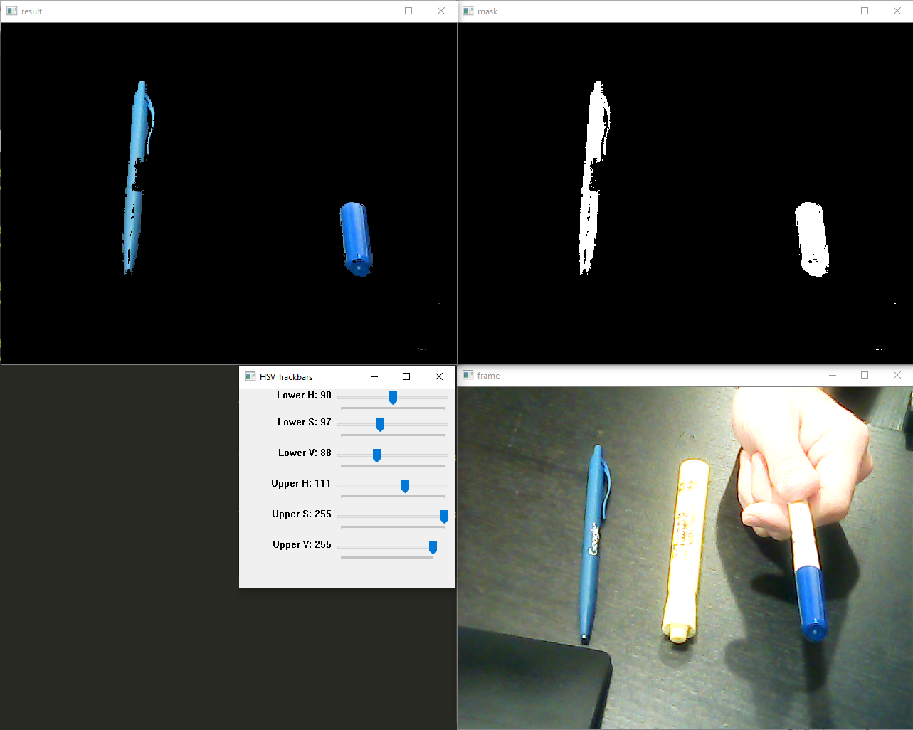
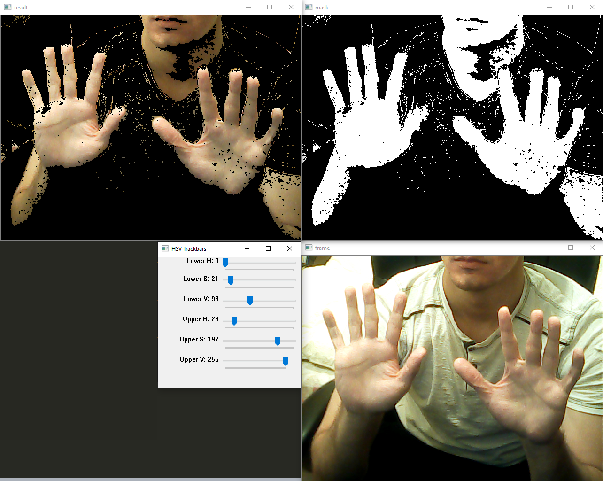

# MOG Background Reduction
Creating background reduction for webcam image processing.
Using this we can preprocess objects that we want to feed into Machine Learning tasks. For example, we want to create classifier for gestures, thus reducing extra background noise would let us focus only on hands and hopefully serve as a great training/testing set for our models.

Background reduction is based on HSV values, rather than RGB color. Trackbars from OpenCV let us easily calibrate HSV lower/upper values for Hue(H), Saturation(S), and Value(V).

# Samples:

